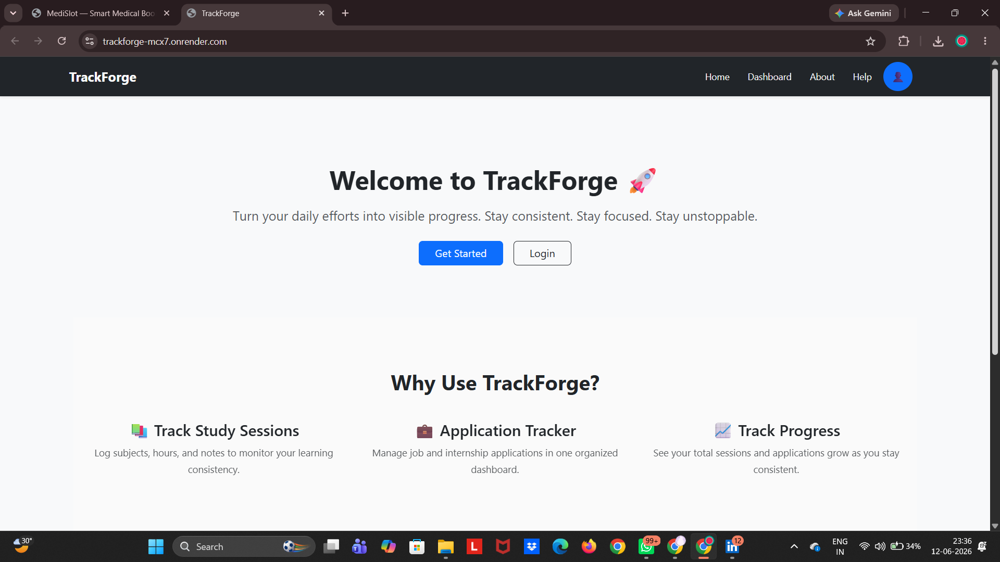
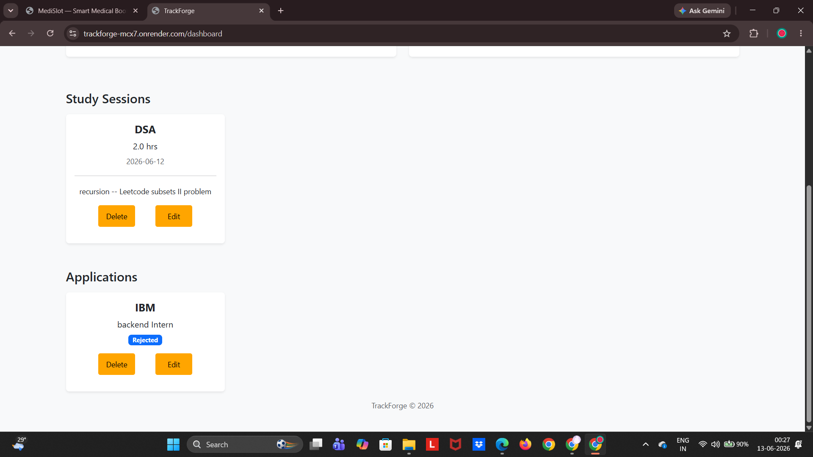

# 🚀 TrackForge

TrackForge is a productivity platform designed to help students efficiently manage study sessions, track learning progress, and organize internship/job applications in one place.

Built using **FastAPI**, **SQL**, and **JavaScript**, TrackForge provides a structured workflow for students preparing for placements and career opportunities.

---

## ✨ Features

- 📚 Study Session Management
- 📈 Learning Progress Tracking
- 💼 Internship & Job Application Tracking
- 🔐 Secure Authentication
- 📊 Dashboard Analytics
- 🗂️ Organized Workflow Management
- 📱 Responsive User Interface

---

## 🖼️ Screenshots

### Home Dashboard



---

### Study Session Management



---

## 🛠️ Tech Stack

### Frontend
- HTML5
- CSS3
- JavaScript

### Backend
- FastAPI
- SQLAlchemy
- SQLite

### Tools
- Git
- GitHub
- VS Code

---

## 🎯 Problem Statement

Students often struggle to manage study schedules and keep track of internship or job applications across multiple platforms.

---

## 💡 Solution

TrackForge provides a centralized platform where students can:

- Organize study sessions
- Track learning progress
- Monitor internship/job applications
- Improve productivity through structured planning

---

## 📂 Project Structure

```bash
TrackForge/
│
├── images/
│   ├── home.png
│   └── session.png
│
├── static/
├── templates/
├── app.py
├── database.py
├── models.py
├── requirements.txt
└── README.md
```

---

## ⚙️ Installation

### Clone Repository

```bash
git clone https://github.com/jahnavipriya05/trackforge.git
cd trackforge
```

### Create Virtual Environment

```bash
python -m venv venv
```

### Activate Environment

#### Windows

```bash
venv\Scripts\activate
```

#### Linux / Mac

```bash
source venv/bin/activate
```

### Install Dependencies

```bash
pip install -r requirements.txt
```

---

## ▶️ Run Application

```bash
uvicorn app:app --reload
```

Application will run at:

```bash
http://127.0.0.1:8000
```

---

## 🌟 Key Learnings

- Building REST APIs with FastAPI
- Database Integration using SQLAlchemy
- Authentication & Session Management
- Backend Architecture Design
- Full-Stack Project Development

---

## 🔮 Future Enhancements

- Email Reminders
- Placement Preparation Tracker
- Resume Management
- Goal-Based Analytics
- AI Study Assistant
- Cloud Database Integration

---

## 👩‍💻 Author

**Jahnavi Priya**

Backend Development • FastAPI • Python • Generative AI

GitHub: https://github.com/jahnavipriya05